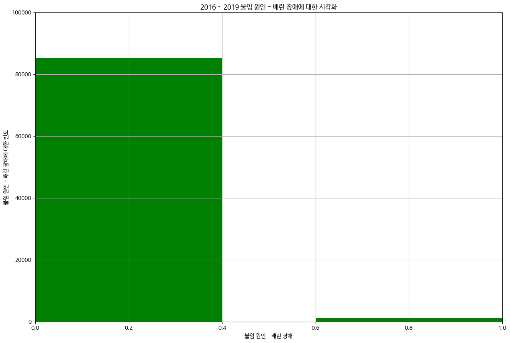

# LGAimers_6th

안녕하세요. 이번 LGAimers 6기를 지원하고 완전히 수료를 하게 된 경희대학교 소프트웨어융합학과 한주상입니다. 제일 우선 제가 이 프로젝트에 대한 내용 개요는 다음과 같습니다.

1. 난임의 개념 및 난임이 이슈화 되고 있는 이유
2. 난임 환자 대상 임신 성공 여부 예측 dataset의 도메인
3. 데이터 전처리(Data preprocessing)
4. 데이터 시각화(Data visualization)
5. 데이터 모델링
6. 데이터 교차 검증 및 평가(ROC-AUC 그래프)
7. 참고문헌

## 난임의 개념 및 난임이 이슈화되고 있는 이유

난임: 1년동안 피임 1번도 하지 않았음에도 임신이 1번도 시행되지 않은 현상
모든 커플은 10 ~ 15%정도 존재한다.

+ 젊은 나이 (10 ~ 20대) 임신에 대한 성공률
  - 3개월 : 57%
  - 6개월 : 72%
  - 1년 : 85%
  - 2년 : 93%
    => 하지만 이것은 젊은 나이의 기준이었을 때의 성공률이다. 연령이 30대 이상이며 연령 나이가 많아질 수록 이 규칙은 깨지게 된다.
+ 왜 이렇게 난임 부부가 많아지고 있는가?
  - 환경 오염: 도시화, 산업화
  - 식생활 문제: 건강하지 않은 먹거리
  - 질병: 외성기 감염, 골반염 등
  - 고연령 임신 시도(ex: 20대 때 아기 가지고 싶은 마음이 안들어서, 연령이 지나고 나서 30대 중반 부터 아이를 가져야 겠다 생각하고 임신 시도 및 난임 현상 발생)
+ 이슈가 되고 있는 이유?
  - 저출산 현상: 저출산의 대표적인 원인이 난임이며 이를 주로 작용하는 요인은 당시 연령 나이가 제일 화두가 됨.
  - 인구 감소: 저출산으로 인해 아기 출산율이 감소하는 동시에 인구 수가 감소가 되고 있다는 것이다.
  - 나이로 인한 노화현상: 연령 나이가 많을 수록 생식 기관의 노화로 인해서 여성 같은 경우에는 배란 유도가 잘 안되며 자궁 착상이 잘 안 된다. 남성 같은 경우에는 무정자증 동시에 정자 운동성의 감소 및 정자 기형이 빈번하게 나타나게 되어서 임신하는 것이 쉽지가 않다.

## 난임 환자 대상 임신 성공 여부 예측 dataset의 도메인
데이터의 Attribute(column)(열)에는 여러가지 요인이 존재하며 domain에 대해서 설명을 하겠습니다.
+ All cycles 
=> 총 시술 주기 = (총 시술 횟수) / (임신 시도 또는 마지막 임신 경과 연수) (1회에 몇 년 동안 총 시술했는지 확인)
+ IVF and ICSI cycles 
=> IVF 시술 주기 = (IVF 시술 횟수) / (임신 시도 또는 마지막 임신 경과 연수) (1회에 몇 년 동안 IVF 시술하는지 확인) 
+ Donor insemination
=> DI 시술 주기 = (DI 시술 횟수) / (임신 시도 또는 마지막 임신 경과 연수) (1회에 몇 년 동안 DI 시술하는지 확인) 
+ IVF birth and pregnancy rates
=> IVF 임신 비율 = (IVF 임신 횟수) / (IVF 시술 횟수)
+ DI birth and pregnancy rates 
=> DI 임신율 = (DI 임신 횟수) / (DI 시술 횟수) 
+ Sperm and egg donors 
=> 기증자 정자 혼합 비율 = 기증자 정자와 혼합된 난자 수 / 혼합된 난자 수
+ Funding
=> 클리닉 내 비율 = (클리닉 내 총 시술 횟수) / (총 시술 횟수)
+ Egg freeze and thaw 
=> 단일별 해동 난자 수 = (해동 난자 수) / (난자 해동 경과일)
=> 단일별 해동된 배아 수 = (해동된 배아 수) /  (배아 해동 경과일)
+ Multiple births 
=> 다태아률 = 총 출산 횟수 / 총 임신 횟수

## 데이터 전처리

+ 결측치 대체
  - 범주형 데이터인 경우 훈련 dataset의 최빈값을 이용하여 결측치를 대체
  - 수치형 데이터인 경우 훈련 dataset의 평균을 이용하여 결측치를 대체.
+ 중복값 제거
+ 행의 필터링
  - 시술 당시 나이 - '알 수 없음'인 것 제거
  - 임신 시도 또는 마지막 임신 경과 연수 - 1보다 크거나 같은 것만 필터링
  - 배란 유도 유형 - 생식기 자극 호르몬 인것 제거하기(이것에 해당하는 데이터 행이 한 개 밖에 없어서)
  - 남성/여성/부부 주/부 불임 원인 열 필터링
  - 불임 원인 .. 에 해당하는 열을 여성 요인과 남성요인들에서 열 필터링
  - 배아 생성 이유들 중 '현재 시술용', '배아 저장용', '기증용' 3가지 우선순위로 대체하는 것을 이용한다.
  - 수집된 신선 난자 수, 저장된 신선 난자 수의 크기에 대해서 행 필터링
  - 혼합한 난자 수에 대한 행 필터

## 데이터 시각화

- 시술 시기 코드<br>
  
- 시술 나이<br>
  
- 시술 유형<br>
  
- 배란 자극 여부<br>
  
- 단일 배아 이식 여부<br>
  
- 남성, 여성, 부부 불임 원인에 대한 히트맵<br>
  
- 불임 원인의 사유에 대한 히트맵<br>
  
- 불임 원인 - 배란 장애<br>
  
- 불임 원인 - 정자 운동성<br>
  
- 불임 원인 - 정자 면역학적 요인<br>
  
- 불임 원인 - 정자 형태<br>
  
- 불임 원인 - 정자 농도<br>
  
- 불임 원인 - 여성 요인<br>
  
- 총 시술 횟수<br>
  
- 클리닉 내 총 시술 횟수<br>
  
- IVF 시술 횟수<br>
  
- DI 시술 횟수<br>
  
- 총 임신 횟수<br>
  
- IVF 임신 횟수<br>
  
- DI 임신 횟수<br>
  
- 총 출산 횟수<br>
  
- IVF 출산 횟수<br>
  
- DI 출산 횟수<br>
  
- 난자 기증자 나이<br>
  
- 정자 기증자 나이<br>
  
- 총 생성 배아 수에 대한 시술 당시 나이에 따른 임신 성공 여부 상자수염 그래프 시각화
  
- 총 생성 배아 수에 대한 시술 유형에 따른 상자수염 그래프 시각화
  

## 데이터 모델링
우선 데이터의 임신성공여부에 대해서 맞는 것과 아닌 것에 대한 불균형 편차가 심하다는 것을 알게 되었다. 따라서, 모델링 하기전에 resample 기법중 SMOTEENN 방법을 이용하여서 임신 성공 여부에 대한 비율을 동등하게 하였다.

```
# SMOTEENN 적용
smote_enn = SMOTEENN(sampling_strategy='auto', random_state=42)
X_resampled, y_resampled = smote_enn.fit_resample(X_train_encoded, y)

# 리샘플링된 데이터 확인 (선택 사항)
print(f"Original dataset shape: {X.shape}")
print(f"Resampled dataset shape: {X_resampled.shape}")
```

Resampling한 데이터 셋을 통해서 분류 모델들 중 대표적으로 boost를 이용한 앙상블 모델들 중 LightGBM 모델을 이용하여서 모델링을 학습시켰습니다. 

LightGBM 모델의 HyperParameter를 이 프로젝트에서는 n_estimators를 400, n_jobs을 -1, 그리고 random_state를 42로 하였습니다. 그리고 학습시킬 때 교차 검증을 이용하여서 훈련 데이터 셋을 다시 훈련, 검증 데이터셋으로 분할시켜서 일부 eval_set을 검증 데이터셋으로 매개로 하였으며, eval_metric가 'logloss'로 해야 classifier로 학습시킬 수 있기 때문에 이런 hyperparmeter로 모델 학습시켰습니다.

```
lgb_roc_model = LGBMClassifier(n_estimators = 400, n_jobs=-1, random_state=42)
# LGBM
lgb_roc_model.fit(
    X = X_train,
    y = y_train,
    eval_set=[(X_valid, y_valid)],
    eval_metric='logloss'
)
lgb_roc_pred = lgb_roc_model.predict_proba(X_valid)[:, 1]
lgb_roc_roc = roc_auc_score(y_valid, lgb_roc_pred)
print('LGBM ROC model - ROC AUC: %.4f' % (lgb_roc_roc))
```

## 데이터 교차 검증 및 평가(ROC-AUC 그래프)
이를 매개로 평가를 한 결과 다음 그림과 같이 roc-auc 그래프의 시각화한 것과 같습니다. DACON에서 학습시킨 데이터로 예측한 결과  roc_auc score은 0.98로 나오게 되었으며, Public score가 0.73103로 성능을 보였습니다.

